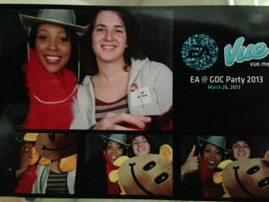
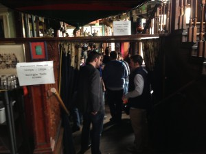
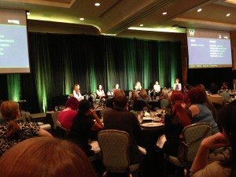
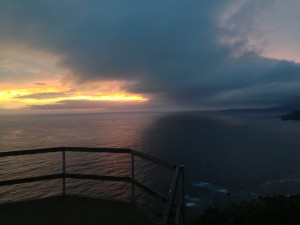

This year I attended my very first Game Developers Conference! I had heard some conflicting opinions on whether to go with an Expo Pass, but decided to bite the bullet and take my first flight out to California for the conference. Boy am I glad I made that choice! GDC was fantastic. California was amazing. I left knowing I will definitely be back every year I can.

So without further ado, some of my experiences:

### Tuesday, March 26th

Tuesday, I arrived in by plane with a whole group of Atlanta game developers. The trip was long, but I was the excitement to arrive kept me happy. After landing Robert and I headed to our friend Julian's who kindly hosted us. We checked into the conference, and spent some relaxing and exploring a bit of the city. Then it was time for some mingling and fun!

I headed over to meet with a friend Joelle for the EA party, which was fantastic. Cool themed drinks, tasty food, and a photobooth we had to check out. We later found out we even made it in their [women in gaming campaign video](http://youtu.be/mrtjMiE_JE4?t=23s) (at 0:23 and 3:47). From there, Joelle and I walked down to the Eve Players Party where I had some interesting discussions on the game. I have never met such a passionate group of game players! After two more stops – the Blacks in Gaming mixer, and to meet up with some fellow Atlantans at the Cartoon Network party – I was worn out and jetlagged, so we headed in for the night.

### Wednesday, March 27th

Wednesday was my first "real" day of the conference. After a preliminary survey of the Expo floor, I headed to a lunch meetup with some fellow Georgia Tech alumni. We gathered down the street at the Hotel Utah. I was completely floored by how many people showed up. We must have had around 30 people almost all within a year of my graduating class. There were many people I hadn't seen since graduating, so it was a great opportunity to catch up on what we were all up to. After lunch, a fellow Yellow Jacket John Swisshelm (who helped coordinate the event) took us down the street to check out his office – Double Fine! It was great getting to walk around one of my favorite game studios. I really loved their setup; everyone had their own (highly decorated) individual area but it was also open enough for constant collaboration.

After lunch, we spent the rest of the afternoon exploring the Expo floor. I ran into a friend from High School who is working at Havok on their new game engine, [Project Anarchy](http://www.projectanarchy.com/). The demo looked really neat, and needless to say I will be keeping an eye on it. After a fantastic dinner at Samovar (duck tea soup), it was time for the Women in Gaming International mixer. They held it down the street at the Comic museum. The venue was amazing (so many cool drawings), and the company was better. It was easily the first time I had seen so many women in gaming in one place. They were from all different places – I met two women from Norway and France – and of all different specialties – talked to designers and programmers, and also a game audio student. I heard a bunch of great stories, and generally felt a great sense of community.

After the party I managed to catch some of the Game Developers Choice Awards. I got to see one of my favorite games of all time, Journey, win the prize for Game of the Year!

### Thursday, March 28th

Thursday morning I spent some more time on the Expo floor before it was time for the Women in Games Luncheon. I can easily say that this was my favorite experience of GDC 2013. After meeting some more people, we headed in to the ballroom for lunch. I sat a table with more new people and we got to watch an [amazing panel with great women speaking](http://www.develop-online.net/features/1848/GDC-2013-Women-In-Games-panel-on-industry-representation) followed by the awards ceremony. The whole thing was very inspirational, and I got to meet and talk to some amazing people!

The rest of the day was spent exploring GDC, having dinner with the Georgia Game Developers Association, and at night we got to go over to Riot's party. They had a really neat setup – people playing League of Legends on stage with and overhead projector, and the dancefloor below. My group "teamed up" with some people we had met at the EA party and I got to make more friends!

### Friday, March 29th – Sunday, March 31st

The next day was pretty quiet. I checked out a panel that was open to all pass holders. The panel described what to do after getting your first job, and gave useful tips for keeping up after "breaking in". Afterwards we took one last look around the Expo hall before it closed down and then spent the rest of the afternoon out on the city. I got to go to my first ["Sushi Boat" experience](https://vine.co/v/bIWLiXuF3YH). It was delicious! Unfortunately after that I succumbed to the dreaded ["con crud"](http://www.urbandictionary.com/define.php?term=con%20crud) and had to go to sleep early.

Saturday and Sunday were reserved for my first adventure in San Francisco. Saturday I checked out the Golden Gate, wine country and took a drive along State Road 1. Sunday was Alcatraz, Fisherman's Wharf, and Ghiradelli. After one more trip to the sushi boats (you can't get fish that good in Atlanta), we headed for the airport home.

Overall, my first experience with GDC and San Francisco was fantastic. Huge shout-outs to my "GDC tour guide" Joelle, who really helped make my first experience as amazing as it was and to Julian for hosting us and showing us around the city. Can't wait for next year!!
