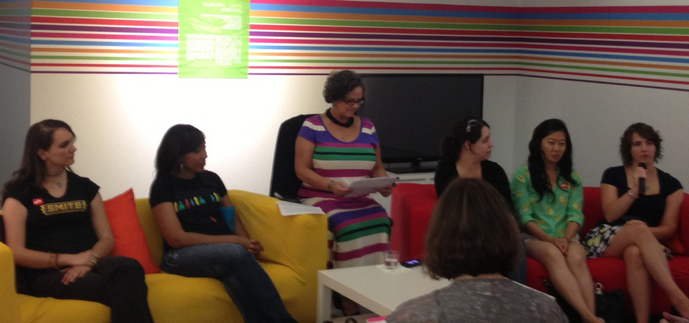

I was thrilled to be invited to speak on my very first panel at this exhibit in July alongside several very talented local game developers! We covered subjects ranging from issues we face in starting our careers, to our favorite games. The panel really made me step out of my comfort zone and learn to speak to others about my experiences.

Afterwards I was approached with the offer to speak on another panel at [SIEGE (Southern Interactive Entertainment and Game Expo)](http://www.siegecon.net/SIEGE2013/) later that year. I was thrilled to do so because I felt I had a lot to say on the subject – First Days in the Industry.

One panel you'll see at many conventions is something along the lines of "how to break in", but rarely had I seen panels about what to do after that. I felt I had a lot to say, because I learned a lot on my journey from extremely nervous new graduate to proficient UI programmer mentoring others. My fellow panelists and I discussed via Google Hangout our topics, and at the panel covered many important lessons: "your first days will be overwhelming – that's ok", "don't be afraid ask for help if you need it, but show you've made an attempt beforehand", etc.

All in all, I've really enjoyed my entry into speaking on panels and can't wait for my next opportunity!
