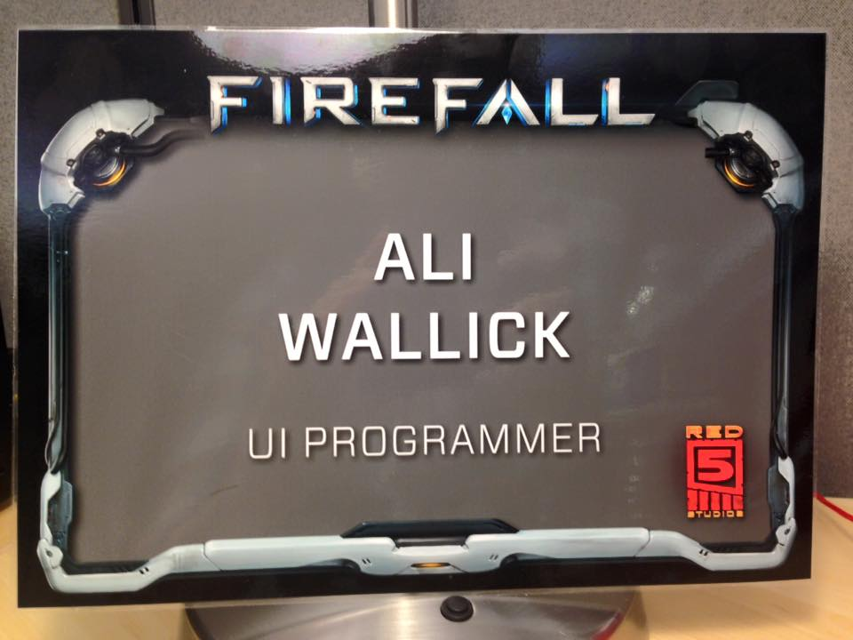

Woo hoo major life update!

In April 2015 I was contacted by [Red 5 Studios](http://www.red5studios.com/) about a position as a UI Programmer on the game [Firefall](http://www.firefall.com). Finally ready to make my pilgrimage across the country like the rest of my college peers, I gladly accepted. Within a month I was packing up my life, my pets, and my now-fiance (fellow game developer [Robert Spessard](http://www.robertspessard.com/)) to move to my new home in Orange County, California.

My first 6 months at Red 5 and on the West Coast have been great. I'm super excited to be a part of a huge overhaul to Firefall that will be released in the near future globally. I'm learning a ton every day, and am grateful to have some new amazing coworkers and friends. I miss Atlanta dearly, but am thrilled about this new adventure I am undertaking. Thank you to all my family and friends who believed in me and helped me get to this point!
