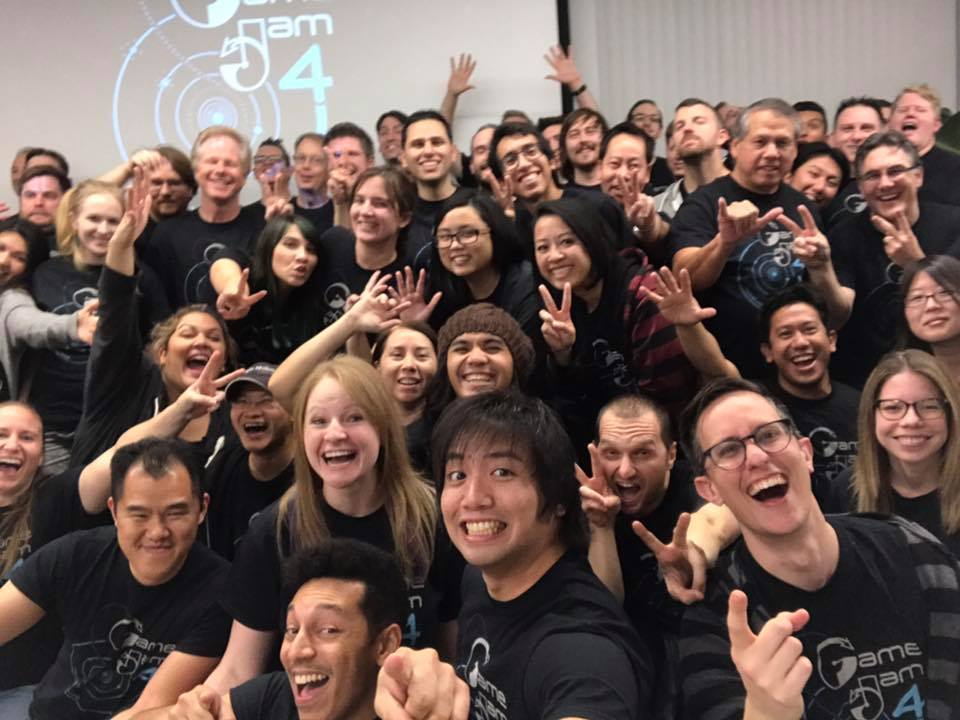

Wow, it's been 3 years since I started at [MobilityWare](http://www.mobilityware.com)! In March of 2016 I found the lovely gem of a company. I was hired as a Software Engineer to work in Unity on Casino-style mobile games, and have loved it ever since. MobilityWare has the oldest and some of the largest card & jigsaw puzzle games on the mobile market. It's really rewarding to board a plane and almost always see someone playing one of our games!

One of the most exciting parts is I'm finally working professionally in Unity. Back in college, we gave Unity a shot at version 3.0. Ever since then, I've used it for student projects and game jams and always really loved it. Now I'm finally getting to really deepen my knowledge of the platform which has evolved an incredible amount since first trying it.

Currently I'm working on [Vegas Blvd Slots](https://www.mobilityware.com/vegas-blvd-slots), a mobile slots game. I'm really enjoying learning about the crazy amount of depth that goes into these machines from every aspect.

Between great coworkers, game jams, annual trips, and company-sponsored events such as volunteering I'm super grateful for a place that can be pretty rare in this industry. And check it out – I even got [an interview on the company's blog!](http://mobilityware.tumblr.com/post/160556308368/meet-ali-wallick-software-engineer-ll-at)
