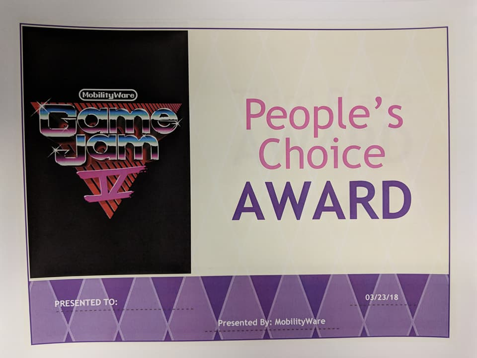

One of the coolest things MobilityWare does every year is a weeklong game jam. On Friday, people get up to pitch an idea for a game, and then employees team up and get to create it over a week. I've participated before (and went for multiplayer which is always a ridiculous game jam choice), but this year I decided to pitch!

Since doing our own game jams and watching our cats in moments of thoughtfulness, Robert and I thought it would be hilarious to do a game about cats fitting in boxes. I thought a tangram-style game with a twist would be perfect for it and pitched alongside Rob. A really great team formed and we were off.

Over a week we developed the game. My biggest focus was on the level creator. I wanted to make sure we could have the tools to create a bunch of levels as I felt this was going to be incredibly important to the demo. We ended up with a really neat little system that exported to json and were able to create 61 levels for pitch day! Our level designers worked really hard on the intro levels and were able to get away without any sort of guided tutorial.

To our delight, the team won the company's vote for best game (the People's Choice Award). Then, our game got picked to be developed for the Facebook Instant Games platform!! That team was really great at keeping me involved throughout the process. The final game ended up being super close in mechanics to the initial design which was also really neat.

It's definitely been one of my proudest moments as a game dev. All my friends loved it and several got pretty addicted. It peaked at 188K daily active users!

[Check it out on Facebook!](https://www.facebook.com/instantgames/218195505572835)
